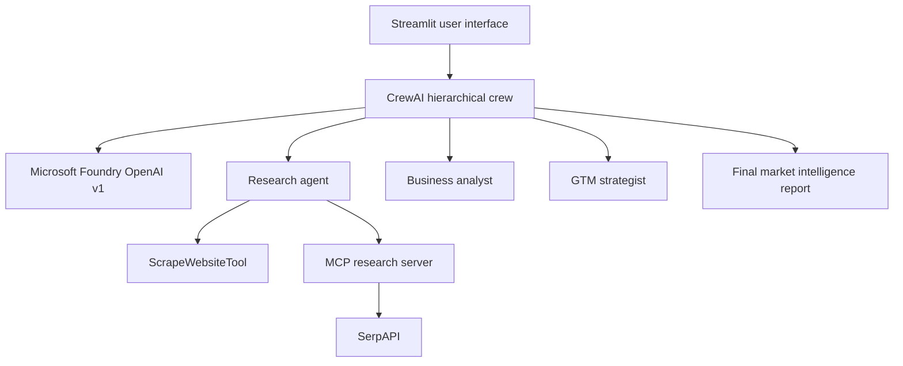

# CrewAI Multi-Agent Market Research & GTM Generator

A local multi-agent AI application that turns a research topic into a structured market-intelligence and go-to-market (GTM) report. The project combines CrewAI orchestration, Microsoft Foundry (OpenAI v1), an MCP research server, SerpAPI, website scraping, and a Streamlit interface.

## Project Overview

The application accepts a topic such as `Simplilearn vs Edureka` and coordinates specialized AI agents to produce:

- Market and competitor research
- Business and market analysis
- A go-to-market strategy
- A consolidated executive report
- Execution-time and task-completion metrics

The included sample run completed four tasks and produced a 26-page report in approximately 286 seconds.

## Architecture



## Agent Team

| Agent | Responsibility |
| --- | --- |
| Head Manager | Coordinates the hierarchical workflow and synthesizes the final report |
| Researcher | Collects market, competitor, portfolio, pricing, and news information |
| Business Analyst | Develops market sizing, competitive analysis, opportunities, and risks |
| GTM Strategist | Produces positioning, messaging, channels, KPIs, and a 30-60-90-day roadmap |

## MCP Research Tools

The local MCP server provides five tools:

- `company_overview`
- `list_competitors`
- `product_portfolio`
- `pricing_snapshot`
- `recent_news_pulse`

## Technology Stack

- Python 3.12
- CrewAI
- Microsoft Foundry OpenAI v1 Responses API
- FastMCP with SSE transport
- SerpAPI via `google-search-results`
- CrewAI `ScrapeWebsiteTool`
- Streamlit
- `uv` for Python environment and dependency management
- `python-dotenv` for local environment variables

## Project Structure

```text
capstone_crewai/
|-- Azure-test-env.py   # Streamlit application and CrewAI workflow
|-- server.py           # Local MCP research server
|-- pyproject.toml      # Project metadata and dependencies
|-- uv.lock             # Reproducible dependency lock file
|-- .python-version     # Python version selection
|-- .env                # Local credentials (never commit this file)
|-- .gitignore
`-- README.md
```

## Prerequisites

- Python 3.12
- `uv` installed
- A Microsoft Foundry model deployment
- A SerpAPI account and API key

This project was tested with the Microsoft Foundry deployment name `vt-agi-chat`.

## Environment Configuration

Create a `.env` file in the same directory as `server.py` and `Azure-test-env.py`:

```env
AZURE_OPENAI_ENDPOINT=https://YOUR-RESOURCE-NAME.services.ai.azure.com/openai/v1/
AZURE_OPENAI_API_KEY=your_azure_api_key
AZURE_OPENAI_CHAT_DEPLOYMENT=your_deployment_name
SERPAPI_API_KEY=your_serpapi_key
```

Optional integrations supported by the application:

```env
TAVILY_API_KEY=your_tavily_key
LANGSMITH_API_KEY=your_langsmith_key
LANGSMITH_TRACING=true
LANGSMITH_PROJECT=your_project_name
```

The Microsoft Foundry v1 endpoint does not require a dated `AZURE_OPENAI_API_VERSION` value.

> Security: Never commit `.env` or expose API keys in source code, screenshots, logs, or documentation.

## Installation

From the project directory, confirm that Python 3.12 is selected and install the locked dependencies:

```powershell
uv python pin 3.12
uv sync
uv run python --version
```

The version check should return `Python 3.12.x`.

## Running the Application

The MCP server and Streamlit interface must run in separate terminals.

### Terminal 1 - Start the MCP server

```powershell
uv run python server.py
```

Wait until the terminal reports that Uvicorn is running on port `8005`. Leave this terminal running.

### Terminal 2 - Start Streamlit

```powershell
uv run streamlit run Azure-test-env.py
```

Open [http://localhost:8501](http://localhost:8501) in a browser.

To stop either process, select its terminal and press `Ctrl+C`.

## Testing

1. Confirm the sidebar displays `Connected (5 tools)`.
2. Enter a research topic, for example:

   ```text
   Compare Simplilearn and Edureka
   ```

3. Wait for the hierarchical CrewAI workflow to complete. A full analysis can take several minutes.
4. Review the final report, latency, and successful-task count in the Streamlit interface.

## Sample Output

The tested `Simplilearn vs Edureka` workflow generated:

- An executive summary
- Market sizing and growth methodology
- Competitor profiles and comparison
- Pricing and portfolio analysis
- Industry trends
- Strategic recommendations
- GTM positioning and messaging
- A 30-60-90-day implementation roadmap
- KPIs, appendices, and reproducibility guidance

## Troubleshooting

### MCP connection timeout

Start `server.py` before Streamlit and confirm this URL is available:

```text
http://127.0.0.1:8005/sse
```

### `GoogleSearch` import error

The server uses `GoogleSearch` from `google-search-results`. The dependency is declared in `pyproject.toml`.

```powershell
uv add google-search-results
```

Do not install a conflicting package solely named `serpapi` for this server implementation.

### Azure API version error

Use the versionless Microsoft Foundry base endpoint ending in `/openai/v1/`. Do not append `/responses` and do not pass a dated API version.

### Unsupported `temperature` parameter

Some Foundry models do not accept `temperature`. The supplied application intentionally omits this parameter.

### Python or ChromaDB/Pydantic compatibility error

Confirm that the project uses Python 3.12:

```powershell
uv run python --version
```

## Responsible Use and Limitations

The report is generated by AI and may contain incomplete, provisional, or incorrect claims. Any market sizes, prices, company facts, recommendations, and citations should be independently verified before they are used for investment, procurement, academic, or business decisions. Clearly label estimates and replace placeholders with validated source data.

## Author

**Ana Marinho**  
[GitHub Profile](https://github.com/anastaciamarinho-hub)

## License

This project is provided for educational and portfolio purposes. Add a license file before permitting reuse or redistribution.
